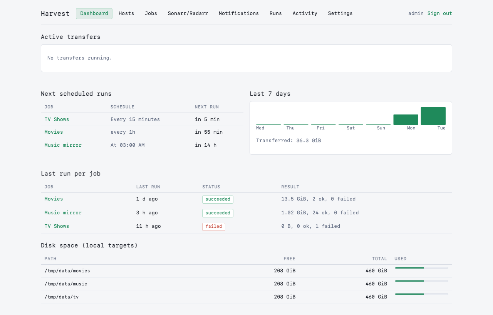
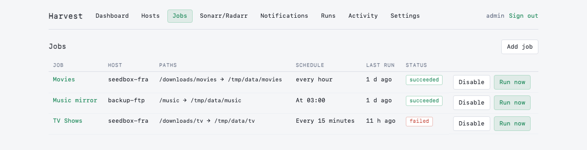
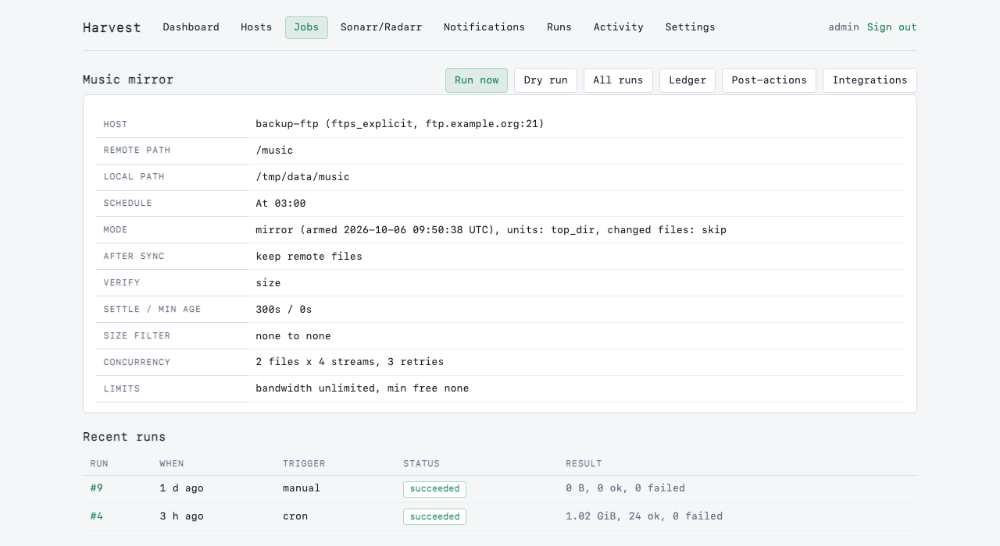
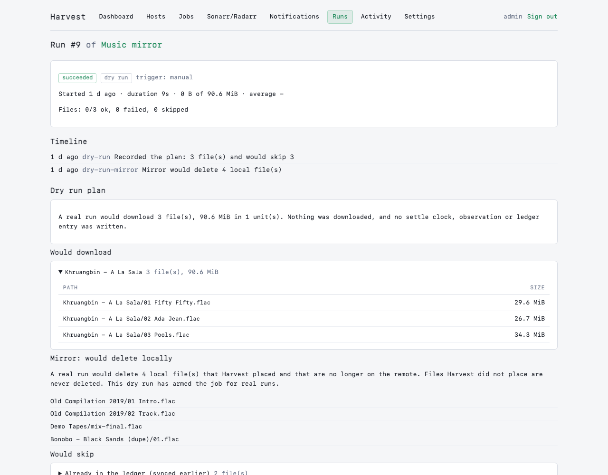

<p align="center"></p>

# Harvest

Self-hosted seedbox to homelab sync. Pulls files from FTP/FTPS/SFTP servers to local folders on a schedule, with a ledger so a deleted local file is never re-downloaded. The settle check and staging directory ensure Sonarr/Radarr/Plex never see a half-written file.

## Screenshots

| Dashboard | Jobs |
|---|---|
|  |  |
|  |  |

## Features

### Phase 1 (Complete)

- **Protocols:** FTP, FTPS (explicit and implicit), SFTP with rclone as transport.
- **Ledger semantics:** each synced file is recorded; local deletion is invisible, so rerunning a job never re-downloads the same file.
- **Settle check:** files must be unchanged for a configurable period before sync; incomplete or growing files are skipped.
- **Staging and atomic rename:** files land in `.harvest-staging` inside each target, then atomically rename once verified. Sonarr/Radarr/Plex see only complete files.
- **Resume and checkpoints:** killed or stalled downloads pick up where they left off; progress is checkpointed every 16 MB.
- **Ranged downloads:** files larger than 256 MB split into parallel byte ranges for speed (up to 8 ranges per file).
- **Filtering:** include/exclude globs, size bounds, default torrent exclusions (`.part`, `*.!qB`, `*.!ut`, `.incomplete/`, rtorrent temp dirs).
- **Scheduling:** cron, interval, manual triggers, plus webhook-triggered runs via job-scoped API tokens.
- **Live dashboard:** web UI with real-time SSE progress, next-run preview, 7-day volume sparkline, disk free per target.
- **Auth:** single-user builtin (scrypt-hashed passwords, CSRF-protected sessions) or `none` (Origin/Host checks for reverse-proxy auth).
- **Docker/Unraid:** multi-architecture images (amd64/arm64), Unraid template.

### Phase 2 (Complete)

- **Webhooks and tokens:** job-scoped API tokens with Bearer auth, rate limiting. Copy-paste curl snippets for qBittorrent, rTorrent, and Deluge.
- **Post-sync actions:** delete from remote, delete after N days (with re-check), move to a folder.
- **Dry-run mode:** plan runs without side effects; see what would download, be skipped, or be deleted.
- **Bandwidth profiles:** global and time-of-day-based limits (timezone-aware).
- **Archive extraction:** zip/7z via `7zz`, RAR via `unar` (extraction happens in staging before atomic move).
- **Post-actions:** chmod (group/others permissions inherited from process PUID/UMASK).
- **Sonarr/Radarr scan:** webhook trigger with per-job path mapping (Harvest path prefix <-> Sonarr host path).
- **Notifications:** ntfy, Discord, Telegram, Pushover, generic webhook (native Node senders; no Apprise).

### Phase 3 (In progress)

- **Prometheus `/metrics`:** done, off by default (`METRICS_ENABLED`).
- **Mirror mode:** done, see below.

- rsync/SCP engines (Phase 2 deferred: scope narrowed; Wave 1 focused on webhooks/actions)
- Torrent client ratio/seed-time gating (qBittorrent/Deluge/rTorrent)
- WebDAV/SMB/S3 support

### Known Limits

- **SFTP host-key pinning:** requires confirmation on first connect; keys are stored and checked on future runs. On mismatch, the run fails loudly.
- **FTPS self-signed certificates:** accepted, but not pinned; MITM attacks are possible on untrusted networks.
- **Parallel ranges unproven on FTPS:** spikes found single-stream better; FTPS behavior varies by network RTT.
- **Remote mtime reliability:** FTP servers often return unreliable mtimes (TLS session timezone issues); settle uses Harvest's observation clock (size + change time).
- **rsync/SCP:** deferred to Phase 3 (out of scope for Phase 2 Wave 1).

## Setting up an FTP or FTPS host

On the host form, **Detect best settings** probes an FTP server with the values you have typed (nothing is saved) and tells you what works:

- **Connection method, most secure first:** FTPS with a verified certificate, then FTPS accepting any certificate, then plain FTP. It never suggests less security than the protocol you already chose, so a host set to FTPS is not downgraded to plain FTP. If only plain FTP works, you are told that your password and files travel unencrypted.
- **Modification times:** whether the server reports them, which decides whether Trust mtime is useful on a job.
- **Resume:** it reads a few KiB from the middle of a file (the same ranged read downloads use) and compares them with the same bytes read from the start.
- **Simultaneous logins:** it holds up to 6 open against one large file and recommends a cap with headroom for Max connections. This needs a file of at least 2 MiB on the server; without one it says "not measured" and keeps your value.

**Apply these settings** fills in the form, and nothing changes until you save. The probe is read-only: it lists, reads a little of one file and opens a few connections, so don't run it while a sync is using the server's connection limit. It is for FTP and FTPS; SFTP is always encrypted, so use Test connection there.

## Webhooks and Torrent Client Integration

After creating a job, generate an API token on the **Tokens** page. The UI displays copy-paste curl snippets for qBittorrent, rTorrent, and Deluge:

**qBittorrent:** `Options > Downloads > Run external program on torrent finished`
```bash
curl -fsS -m 30 -X POST -H "Authorization: Bearer <token>" https://harvest.example.com/hooks/jobs/<id>
```

**rTorrent:** Add to `.rtorrent.rc`
```
method.set_key = event.download.finished, harvest_hook, "execute.throw.bg = curl, -fsS, -m, 30, -X, POST, -H, 'Authorization: Bearer <token>', https://harvest.example.com/hooks/jobs/<id>"
```

**Deluge:** `Preferences > Execute plugin`, event `Torrent Complete`, command `/config/harvest-hook.sh`
```bash
#!/bin/sh
curl -fsS -m 30 -X POST -H "Authorization: Bearer <token>" https://harvest.example.com/hooks/jobs/<id>
```

The webhook triggers a new run if one is not already running. Files on the remote that haven't settled yet schedule a follow-up run after the settle period.

## Quickstart (Docker Compose)

Copy and edit `docker-compose.example.yml`:

```bash
cp docker-compose.example.yml docker-compose.yml
# Edit: set APP_SECRET, ADMIN_USER, ADMIN_PASS, and volume mounts
docker-compose up -d
```

The web UI listens on `http://localhost:8099` by default. On first run, log in with the credentials set in `ADMIN_USER` and `ADMIN_PASS`, or retrieve the one-time setup token from the container log if those environment variables were not set.

## Unraid Installation

Harvest is not in Community Applications. Install it from the template repository, or add the container by hand.

**With the template:** in Settings → Docker (advanced view), add `https://github.com/Pross/unraid-templates` under Template repositories. Then in the Docker tab choose Add Container and pick `harvest` from the Template dropdown. The template file is `https://raw.githubusercontent.com/Pross/unraid-templates/main/harvest.xml`.

**By hand:** in the Docker tab choose Add Container and set:
- Repository: `ghcr.io/pross/harvest:latest`, network type `bridge`
- Port: container `8099` to host `8099` (TCP)
- Path: `/config` to `/mnt/user/appdata/harvest` (read/write)
- Path: `/data/<name>` to a download share (read/write), one per target
- Variables: `APP_SECRET`, `ADMIN_USER`, `ADMIN_PASS`, plus `PUID=99`, `PGID=100`, `UMASK=002` and `TZ` as needed (see Configuration below)

**Setup:**
1. Set `App Secret` to a long random string (e.g., `openssl rand -hex 32`), and keep it stable—changing it makes stored host credentials unreadable.
2. Set `Admin User` and `Admin Password` (at least 8 characters).
3. Map download target(s) under `/data/<name>` (e.g., `/mnt/user/downloads:/data/downloads`).
4. Run the container.
5. Open the web UI at `http://<unraid-ip>:8099`.

**Important:** staging (`.harvest-staging`) is created inside each target directory, so the target volume must be a single mount. Never map a target such that staging and the final path cross filesystems; Harvest refuses to start a job if `stat().dev` differs.

**User/group:** PUID 99 (nobody) and PGID 100 (users) are Unraid defaults. Container ownership and permissions are set at startup via `docker-entrypoint.sh`.

**Public access:** the Docker image (`ghcr.io/pross/harvest:latest`) is public by default. For Unraid to pull it, ensure the GHCR package is set to public in your GitHub repository settings.

## Configuration

All settings are environment variables (Unraid exposes them as Config entries; Docker Compose as `environment:` keys).

| Variable | Default | Description |
|---|---|---|
| `PORT` | 8099 | HTTP port for the web UI. |
| `HOST` | 0.0.0.0 | Bind address. |
| `APP_SECRET` | *required* | Encrypts stored remote credentials (FTP/SFTP passwords). Must be a long random string and should never change. If unset, a key is auto-generated and stored at `/config/.app_secret` (but changing it later makes saved credentials unreadable). |
| `CONFIG_DIR` | /config | Persistent storage: SQLite database, temporary files, logs. Single volume mount on Unraid. |
| `BROWSE_ROOTS` | /data | Comma-separated list of container paths exposed in the local folder browser (e.g., `/data,/media`). |
| `AUTH_MODE` | builtin | Authentication mode: `builtin` (single user, session cookie) or `none` (no login, but Origin/Host checks still apply—use only behind your own reverse proxy). |
| `ADMIN_USER` | (unset) | Username for initial admin user (builtin auth only). Applied only when no user exists. Afterwards, change it via the Settings page. |
| `ADMIN_PASS` | (unset) | Password for initial admin user. Minimum 8 characters. Applied only when no user exists. Afterwards, change it via the Settings page. |
| `COOKIE_SECURE` | false | Set to `true` when the app is served over HTTPS (via a reverse proxy). Controls the `Secure` flag on session cookies. |
| `METRICS_ENABLED` | false | Serve Prometheus metrics at `/metrics`. **No login is required when enabled**, so anyone who can reach the port can read job names and transfer stats; keep the port on your LAN or put it behind your own proxy. See Metrics below. |
| `TRUST_PROXY` | false | Configures trust in reverse-proxy headers (`X-Forwarded-For`, `X-Forwarded-Proto`) for correct client IP and HTTPS detection. Options: `false` (default), `true` (trusts any proxy—only safe if the proxy overwrites the header), a hop count (e.g., `1`), or a comma-separated list of proxy IPs/CIDRs (e.g., `172.18.0.0/16,10.0.0.1`). Unraid users typically use `false`. |
| `PUBLIC_URL` | (unset) | The public URL of the app (e.g., `https://harvest.example.com`). Used to generate webhook URLs and validate cross-site requests. If unset and `AUTH_MODE=none`, a startup warning is printed. |
| `ALLOWED_HOSTS` | (unset) | Optional Host header allowlist (comma-separated). If set, requests with an unknown Host are rejected with a 421 status. Useful to block DNS rebinding attacks. Leave unset if behind a trusted reverse proxy. |
| `MAX_CONCURRENT_RUNS` | 2 | Maximum number of jobs that can run concurrently. |
| `MAX_CONCURRENT_FILES` | 4 | Maximum number of files being transferred across all concurrent runs. |
| `RCLONE_BIN` | rclone | Path to the rclone binary. The Docker image includes it at `/usr/local/bin/rclone`. |
| `RANGE_MIN_BYTES` | 268435456 | Files smaller than this (default 256 MB) use a single byte range. Larger files split into multiple ranges for parallel downloads. |
| `CHECKPOINT_BYTES` | 16777216 | Fsync and checkpoint progress every N bytes per range (default 16 MB). A crash loses at most this much progress. |
| `STALL_TIMEOUT_SECONDS` | 120 | Kill and retry a byte range if no bytes arrive in this many seconds. |
| `CONNECT_TIMEOUT_SECONDS` | 30 | Timeout for rclone to connect and deliver the first byte. |
| `LOG_LEVEL` | info | Logging verbosity: `silent`, `fatal`, `error`, `warn`, `info`, `debug`, `trace`. |
| `TZ` | UTC | Timezone for schedules and log timestamps (e.g., `Europe/London`). |
| `PUID` | 99 | User ID the app runs as. Harvest never runs as root. Unraid default is 99 (nobody). |
| `PGID` | 100 | Group ID the app runs as. Unraid default is 100 (users). |
| `UMASK` | 002 | File creation mask applied at startup (e.g., `002` allows group writes). |

## Mirror mode

A job in mirror mode keeps the local folder in step with the remote: files that disappear from the remote are deleted locally, and files you deleted locally are downloaded again. **It deletes files on your disk**, so it is fenced in:

- **Only files Harvest placed are ever deleted.** Candidates come from the job's ledger. Anything you added to the folder by hand is never touched, and a file whose size no longer matches what Harvest placed (you edited it) is kept and dropped from the ledger.
- **Typed confirmation.** Switching a job to mirror needs the job's name typed into the form.
- **A dry run must come first.** A real mirror run is refused ("not armed") until a dry run has finished and armed the job. The dry run page lists exactly which local files a real run would delete. Changing the job's mode, host, remote path or local path disarms it again.
- **Only after-sync "Keep remote files".** Otherwise the remote copy disappears after syncing and the mirror would delete the local one. The form and the executor both refuse the combination.
- **Deletes only follow a clean run.** If any download failed or was dropped (for example for lack of space), nothing is deleted that run. The sweep also refuses if the remote listing is empty, or if it would delete more than half of the ledger (when that is more than 10 files). That catches a wrong remote path or a truncated listing. If that is really what you want (the seedbox is genuinely empty, or you removed those files), open the job and use **Allow one large delete**: it needs a tick-box, lets the next real run delete past those two limits, is used up by that run, and expires after 24 hours. Run a dry run first, which honours the permission and lists exactly what would be deleted. Forgetting ledger entries is not a way to delete files: it only makes Harvest stop tracking them, so their local copies stay.
- **Safe on disk.** Each delete is checked to stay inside the job's local folder without following symlinks, must be a regular file, and empty parent folders are tidied up to (never including) the local folder.

A mirror run also records what happened as activity entries, and any file it kept makes the run `partial`.

## Metrics

Set `METRICS_ENABLED=true` to serve Prometheus text-format metrics at `/metrics` (no authentication; see the warning in the table above). Values are read from the database at scrape time, so they survive restarts. Dry runs are excluded.

| Metric | Labels | Meaning |
|---|---|---|
| `harvest_jobs` | `enabled` | Configured jobs |
| `harvest_active_runs` | | Runs queued or executing |
| `harvest_active_speed_bytes_per_second` | | Combined speed of active runs |
| `harvest_runs_retained` | `state` | Runs still stored, by state (old runs are purged, so this is not a lifetime counter) |
| `harvest_job_last_run_success` | `job` | 1 if the last finished run succeeded, 0 if partial or failed |
| `harvest_job_last_run_finished_timestamp_seconds` | `job` | When the last finished run ended |
| `harvest_job_last_run_bytes` | `job` | Bytes moved by the last finished run |
| `harvest_job_last_run_failed_files` | `job` | Files that failed in the last finished run |
| `harvest_job_ledger_files` / `harvest_job_ledger_bytes` | `job` | Size of the job's ledger (forgotten entries excluded) |
| `harvest_process_start_time_seconds` | | When this process started |

Prometheus scrape config:

```yaml
scrape_configs:
  - job_name: harvest
    static_configs:
      - targets: ["<unraid-ip>:8099"]
```

A useful alert: `time() - harvest_job_last_run_finished_timestamp_seconds > 86400` for a job that should run daily.

## First-Run Login

**With `ADMIN_USER` and `ADMIN_PASS` set:** the container starts and the credentials are applied on first run. Log in immediately.

**Without those variables:** a one-time setup token is printed to the container log (viewable via `docker logs <container>` or Unraid's WebUI). Visit the URL in the log to create the first admin user.

Afterwards, change credentials via the Settings page. The `ADMIN_USER` and `ADMIN_PASS` environment variables are ignored.

## APP_SECRET and Credential Encryption

Stored remote credentials (FTP/SFTP passwords and SSH keys) are encrypted with AES-256-GCM using a key derived from `APP_SECRET`.

- **If `APP_SECRET` is set:** it is used immediately.
- **If `APP_SECRET` is unset:** a random key is generated at startup and stored in `/config/.app_secret` (readable only by the container user). This file must be backed up separately; if it is lost, stored credentials cannot be decrypted and must be re-entered.

Changing `APP_SECRET` makes all stored credentials unreadable. If this happens, the UI shows "Stored credentials cannot be decrypted. Re-enter them," and you must update each host's credentials.

## AUTH_MODE and Security

**`AUTH_MODE=builtin` (default):** Single-user login with username/password. Credentials are checked against a scrypt hash. Sessions are stored server-side in SQLite, keyed by a random token in an HttpOnly, SameSite=Lax cookie. Every non-GET request requires a CSRF token. The Origin header is checked to prevent cross-site POST attacks.

**`AUTH_MODE=none`:** No login required. Every request is treated as authenticated. A CSRF token is generated per process, and the Origin/Host checks still apply to prevent cross-site mutations. Use this only when the app is behind a reverse proxy with its own authentication (e.g., nginx with basic-auth or a dedicated auth gateway).

When `AUTH_MODE=none` and `ALLOWED_HOSTS` is unset, Harvest prints a startup warning: set both to prevent DNS rebinding attacks. `PUBLIC_URL` is also recommended.

## TRUST_PROXY

Use `TRUST_PROXY` when the app is behind a reverse proxy:

- **`false` (default):** `X-Forwarded-For` and `X-Forwarded-Proto` headers are ignored. The app sees the proxy's IP as the client.
- **`true`:** The app trusts any `X-Forwarded-For` header. Only safe if the reverse proxy **overwrites** the header (not appends to it). If the proxy appends, a malicious client can spoof their IP. Avoid this in production; use a hop count or IP list instead.
- **Hop count (e.g., `1`):** The client IP is the Nth entry from the right in `X-Forwarded-For`. For one reverse proxy, use `1`.
- **IP list (e.g., `172.18.0.0/16,10.0.0.1`):** Only these proxy IPs are trusted; `X-Forwarded-For` is checked only if the request comes from one of them.

Example: Unraid with Traefik at `172.18.0.0/16` should set `TRUST_PROXY=172.18.0.0/16`.

## Security Notes

- **Credentials at rest:** Remote passwords and SSH keys are encrypted with AES-256-GCM and stored in the SQLite database. Never logged or sent to the UI after save.
- **Credentials in transit:** Always use HTTPS in production. Use `COOKIE_SECURE=true` and `TRUST_PROXY` if behind a reverse proxy.
- **SFTP host-key pinning:** When you test a connection to an SFTP host, Harvest runs `ssh-keyscan`, displays the host keys with their SHA256 fingerprints, and asks for confirmation before saving. On future runs, the stored key is checked; a mismatch fails the run with a warning and requires re-confirmation.
- **FTPS self-signed certificates:** Harvest can accept self-signed FTPS certificates, but the certificate is not pinned. A man-in-the-middle attack is possible. Use only on trusted networks.
- **Remote deletion:** Files are deleted from the remote only after they are verified locally and the ledger entry is committed. A failed deletion does not block the job; it is retried by the maintenance task.

## How Sync Works

1. **Listing:** The app connects to the remote host and recursively lists files under the remote path.
2. **Filtering:** Files are filtered by glob patterns (include/exclude), size bounds, and default exclusions. Files matching in-progress markers hold their entire unit until the marker is gone.
3. **Settle check:** A file is eligible only if it has not changed for `settle_seconds` and its remote mtime age is >= `min_age_seconds`. Unsettled files schedule a follow-up run.
4. **Ledger check:** Existing ledger entries are skipped unless `changed_policy=resync` and the remote size differs.
5. **Planning:** Files are grouped into units and checked against free-space and concurrency caps.
6. **Download:** Files transfer to `.harvest-staging/` with parallel byte ranges, checkpoints, and resume.
7. **Extraction (Phase 2):** Archives are extracted in staging before final placement (zip/7z/RAR).
8. **Verification:** Received byte count is checked; optional checksum compare to remote hash.
9. **Finalize and promote:** Files atomically rename to final location; ledger is updated. Post-sync actions apply if remote unchanged.
10. **Post-actions (Phase 2):** chmod, Sonarr/Radarr scan, delete/move from remote, notifications.

## Ledger: Resume and Forget

The Ledger UI (`/jobs/<id>/ledger`) shows every file Harvest has seen, plus their sync status.

**Resume:** if a file is marked as forgotten, you can resume it (un-forget it) to sync it again on the next run.

**Forget:** if you want to remove a file from the ledger without syncing it again, click Forget. On the next run, the file will be treated as new and synced. This is useful if you accidentally deleted a local file and want to re-download it, or if you want to abandon an incomplete download.

Forget operates at three scopes: one file, a unit (e.g., a season pack), or everything for the job.

## Backups

The container includes a backup script at `/app/scripts/backup.sh`. Run it to create a consistent snapshot:

```bash
docker exec <container> /app/scripts/backup.sh
```

Backups land in `/config/backups/` as a timestamped tarball containing the SQLite database and logs. To restore, extract it into `/config/` (stop the container first).

```bash
docker exec <container> /app/scripts/restore.sh /config/backups/harvest-backup-<ts>.tar.gz
```

Restore checks integrity, moves the current `db/` and `logs/` aside, and swaps in the restored data. See the script for details.

## Development

**Requirements:** Node.js >= 20, and `rclone` (install via package manager or download from https://rclone.org/downloads/).

**Setup:**
```bash
npm install
cp .env.example .env
# Edit .env if needed (sensible defaults are provided)
```

**Dev server (with hot reload):**
```bash
npm run dev
```

Listens on `http://localhost:8099` by default.

**Build:**
```bash
npm run build
npm start
```

**Type check:**
```bash
npm run typecheck
```

**Unit tests:**
```bash
npm test
```

**Integration tests** (requires Docker):
```bash
npm run test:integration
```

These spin up FTP/FTPS/SFTP test servers and verify the full sync pipeline. Skipped by default; use `npm run test:integration` to run them.

**File limits:** the repo enforces max 300 lines per file and max 30 lines per function. Check with:
```bash
npm run check:limits
```

**rclone binary:** by default, `npm run dev` and tests use `rclone` from `PATH`. To use a local build (e.g., for testing new features), set `RCLONE_BIN`:
```bash
RCLONE_BIN=./.tools/rclone npm run dev
```

## Project Layout

```
src/
  core:           index.ts config.ts logger.ts db.ts crypto.ts
  migrations/     Database schema (001-010)
  engine/         RcloneEngine, process spawning, error mapping
  planner/        Planning, ledger, filters, settle, rules
  run/            Executor, range downloader, transfer, verify, finalize, space, post-actions
  schedule/       Scheduler, triggers, maintenance
  web/            Auth, CSRF, sessions, SSE, routes (hosts/jobs/runs/activity/ledger/settings/hooks/tokens)
  post/           Extraction (Phase 2), *arr, notifications, chmod
  views/ public/  HTML templates (eta), htmx + SSE ext

tests/           Unit and integration suites
scripts/         backup.sh, restore.sh, check-limits.mjs
Dockerfile       Multi-stage: node 24, rclone, sqlite3, openssh-client, 7zip, unar
```

## License

MIT.
